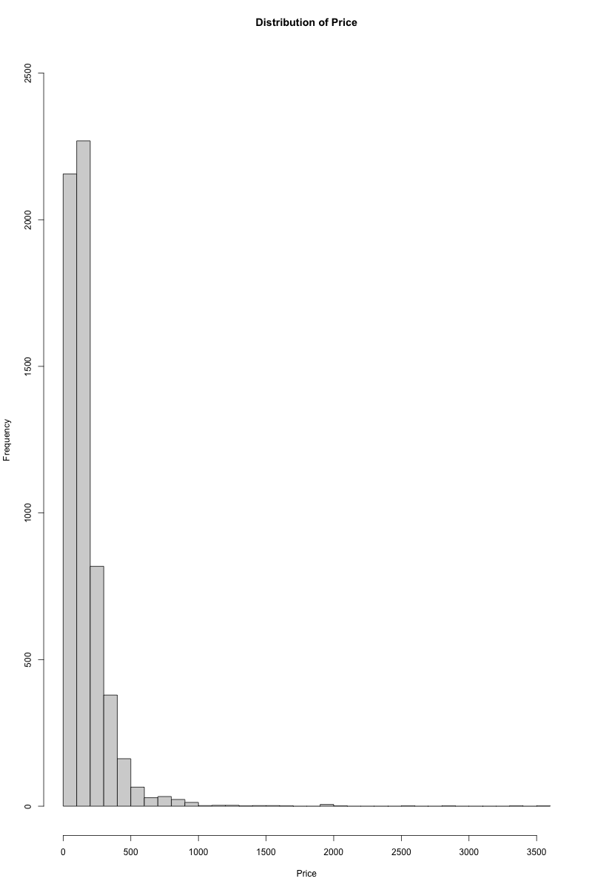
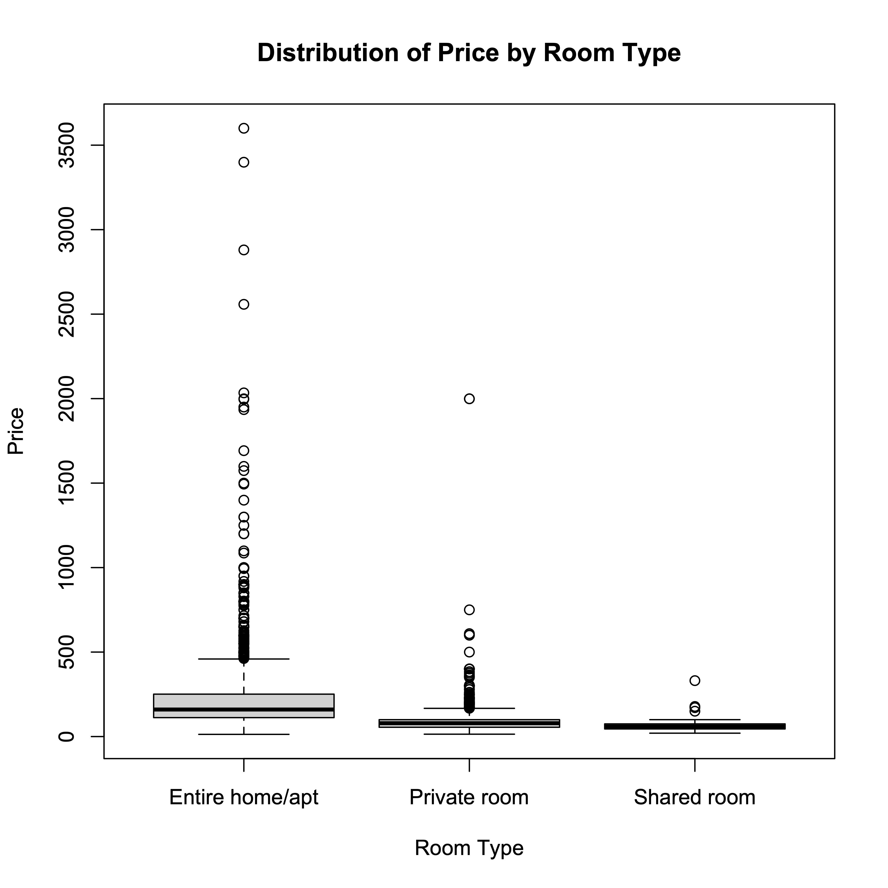
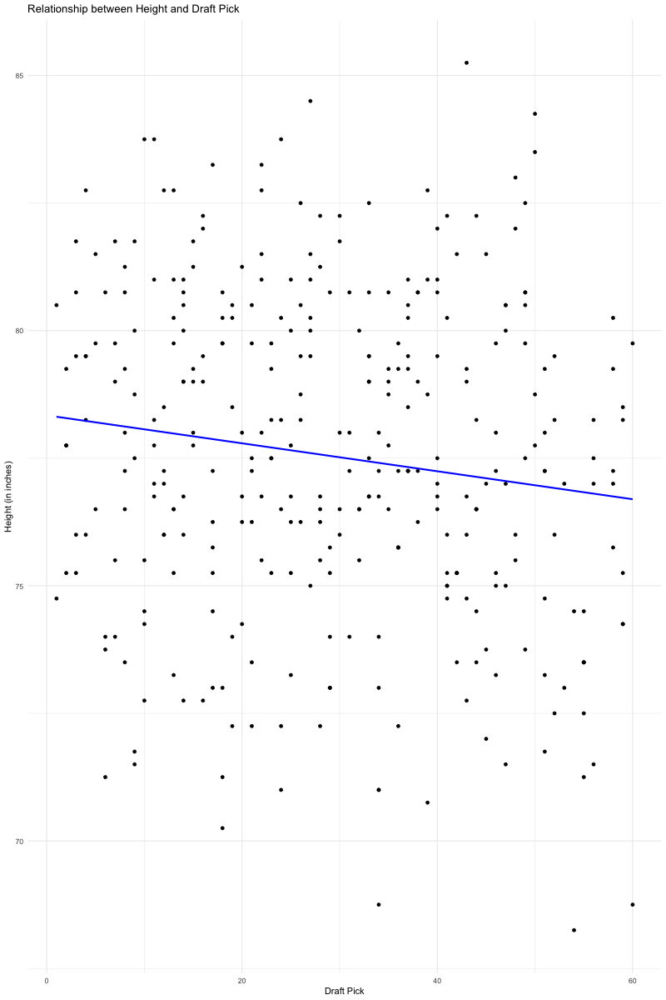
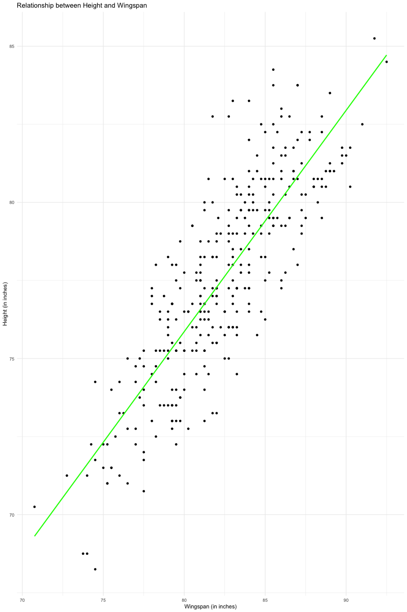
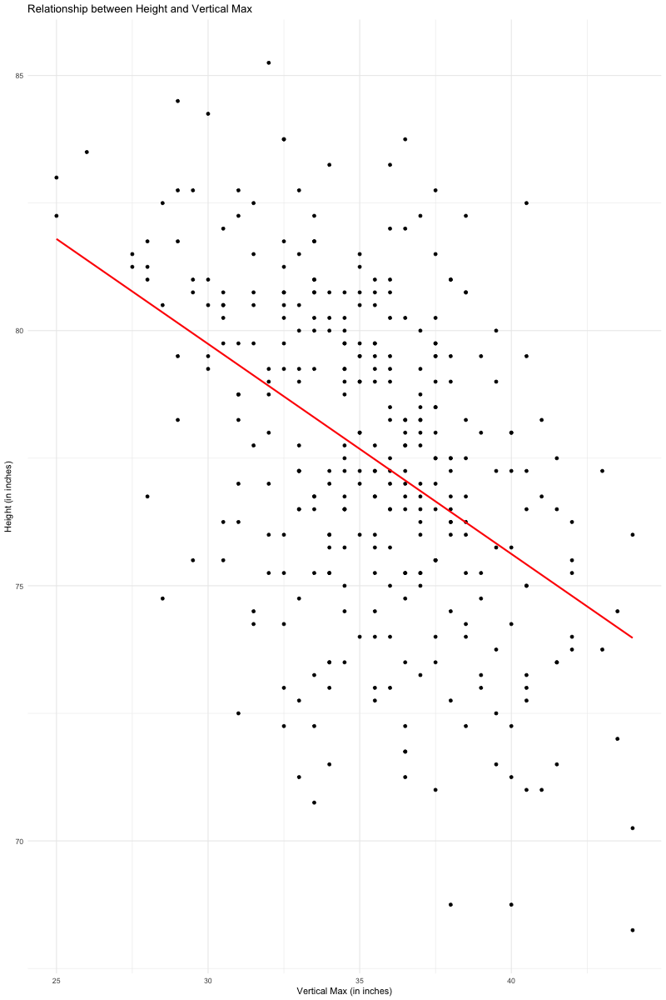
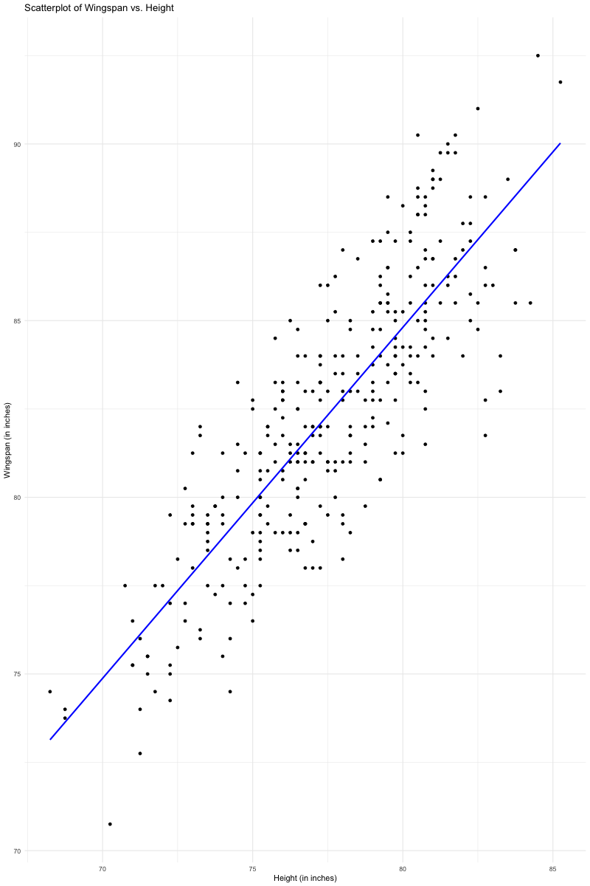
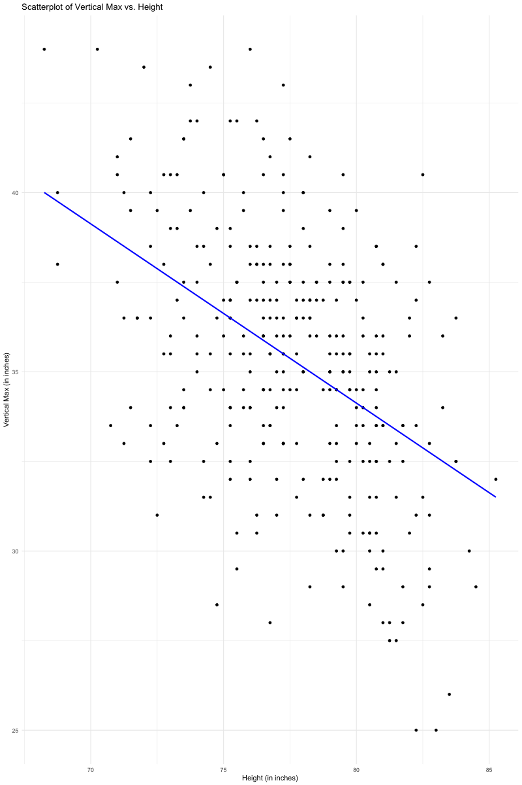
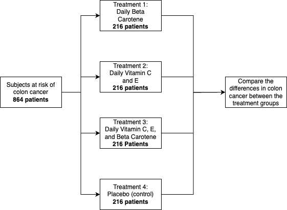

# Assignment 1

## Q1

### 1a

The histogram above is fundamentally right skewed, with most of the data appearing in the left 10% of the graph. As this graph has some significant outliers, I have chosen to use median as my measure of center, as mean would be thrown off by the outliers. In this case, the median is 131.

For the measure of spread, I have chosen to use quartiles. A range measurement would be thrown off by outliers, and would not accurately represent the spread of the dataset. The first quartile is 89, the second quartile is 131, and the third quartile is 216. This means that our data is centered on 131, and that 50% of the data points fall between 89 and 216.

### 1b

### 1c

**Conditional Distribution for Downtown:**

Entire home/apt: $1068 / 1213 ≈ 0.88$ (rounded to two decimal places)

Private room: $145 / 1213 ≈ 0.12$

**Conditional Distribution for Kitsilano:**

Entire home/apt: $367 / 486 ≈ 0.76$

Private room: $119 / 486 ≈ 0.24$

**Conditional Distribution for West End:**

Entire home/apt: $345 / 430 ≈ 0.80$

Private room: $85 / 430 ≈ 0.20$

### 1d

There is some variation in the distribution of room types among the neighborhoods, but to draw a more conclusive inference about the association, namely that downtown is more likely to offer an entire home/apt than Kitsilano or the West End.

## Q2

### 2a

Height and Draft Pick have a weak negative relationship of -0.135, implying that there's only a slight tendency for shorter players to be selected later in the draft.

Height and Wingspan have a strong positive relationship of 0.839, indicating that as players get taller, they typically have longer wingspans.

Height and Vertical Max have a moderate negative relationship of -0.454, suggesting that players with greater vertical jump heights tend to be slightly shorter on average.

### 2b

To decide whether a least squares regression is appropriate, I will be finding the r-squared value for the relationship between the dependent variable (draft pick) and the independent variable (height), as well as the p-value.

The r-squared value is 0.0181, indicating that only about 1.81% of the variance in draft pick can be explained by height. This is relatively low, indicating a weak linear relationship between height and draft pick.

The p-value is 0.014, which also indicates a relatively weak linear relationship between height and draft pick. Due to both the p-value and r-squared values being low, a least squares regression is not appropriate for this dataset, as height is not a strong predictor of a player's draft position.

### 2c

I will again be using the r-squared value and p-value for the relationship between the dependent variable (wingspan) and the independent variable (height).

The R-squared value in this case is 0.7037, which is relatively high.
This indicates that approximately 70.37% of the variance in wingspan can be explained by the player's height, showing that height is a good predictor of wingspan for this dataset.

The p-value is 2.22e-16, which is essentially zero. The extremely low p-value suggests that there is a highly significant linear relationship between height and wingspan.

Given the strong linear relationship indicated, a least square regression line is a good fit.

The equation for the least square regression line is as follows: $\text{Wingspan} = 5.34 + 0.99 * \text{Height}$.

This graph clearly indicates a strong linear fit. Many of the datapoints are close to the line, and the x-values increase as the y-values do.

### 2d

(i)

The least squares regression line is as follows: $\text{Vertical Max} = 74.13 - \frac{\text{Height}}{2}$

(ii)

The relevant plot with the regression line fitted appears below:

The fit is adequate. Most datapoints appear near the line, and as x-values increase, y-values tend to decrease, as indicated by the negative slope of -1/2.

(iii)

The intercept (74.13) represents the estimated vertical max when the player's height is zero. In the context of basketball, it doesn't make sense for a player to have a height of zero, so the intercept is not directly interpretable in this context.

The slope (-0.5) represents the estimated change in vertical max for a one inch change in height. In this case, for each additional inch in height, the vertical max is expected to decrease by half an inch.

(iv)

To predict the vertical max for one player who is 80 inches tall and another who is 100 inches tall, we use the equation for the regression line.

 $74.13 - \frac{80}{2}=34.13$, so the predicted vertical max for a player who is 80 inches tall is 34.13 inches.

 $74.13 - \frac{100}{2}=24.13$, so the predicted vertical max for a player who is 80 inches tall is 24.13 inches.

 There is no issue with either calculation fundamentally, but taking a look at the data shows that the tallest basketball player is only 85.25 inches. This indicates that trying to predict the vertical max of a player who is 100 inches tall is not very statistically valuable, as we do not have enough data for heights close to 100 inches. The 80 inch height has much more data near it, so it is much more likely to be a valuable estimation.

## Q3

<ol type="a">
  <li>The experimental units in this study are the 864 people who were at risk of colon cancer and participated in the experiment.</li>
  <li>The factors in this experiment are the types of vitamins or treatments assigned to the subjects. There are four treatment groups: daily beta-carotene, daily vitamins C and E, all three vitamins every day, and daily placebo.

  Response Variable: The response variable is the incidence of colon cancer, which is being studied to determine if the treatments have any effect.</li>
  <li>The treatments in this experiment are as follows:

  Daily beta-carotene

  Daily vitamins C and E

  All three vitamins (beta-carotene, vitamins C, and E) every day

  Daily placebo (control group)</li>
  <li> Study Diagram

  </li>
  <li>A double-blind study means that both the researchers conducting the experiment and the participants (subjects) are unaware of which treatment group each participant belongs to. This is done to minimize bias and ensure that the results are not influenced by expectations or preconceptions.</li>
  <li>"No significant difference" means that the statistical analysis of the data from the experiment did not show a statistically significant variation in the incidence of colon cancer among the different treatment groups. In other words, the experiment did not find any clear evidence that taking antioxidants (beta-carotene, vitamins C and E) had a significant effect on preventing colon cancer compared to the placebo group.</li>
  <li>A lurking variable that could explain why people who eat lots of fruits and vegetables have lower rates of colon cancer is the overall diet and lifestyle of the individuals. People who consume a diet rich in fruits and vegetables are likely to have other healthy dietary and lifestyle habits, such as lower consumption of processed and red meats, higher fiber intake, and regular physical activity. These factors, rather than antioxidants alone, may be responsible for the observed benefits of fruits and vegetables in preventing colon cancer.</li>
</ol>

## Q4

<ol type="a">
  <li>The experimental unit in this study is each of the four car models: Ferrari Maserati, Lamborghini Aventador, Ford Fiesta, and Toyota RAV-4.</li>
  <li>Factors:
  
  Factor 1: Type of Composite Additive (Greta100, Greta200, Greta500)
  
  Factor 2: Ethanol Content (0%, 5%, 10%)</li>
  <li>Treatments:
  
(a) The experimental unit in this study is each of the four car models: Ferrari Maserati, Lamborghini Aventador, Ford Fiesta, and Toyota RAV-4.

(b) Factors:

Factor 1: Type of Composite Additive (Greta100, Greta200, Greta500)
Factor 2: Ethanol Content (0%, 5%, 10%)
(c) Treatments:
There are 12 treatments in this experiment, representing all possible combinations of the two factors:
    <ol>
      <li>Greta100 with 0% ethanol</li>
      <li>Greta100 with 5% ethanol</li>
      <li>Greta100 with 10% ethanol</li>
      <li>Greta200 with 0% ethanol</li>
      <li>Greta200 with 5% ethanol</li>
      <li>Greta200 with 10% ethanol</li>
      <li>Greta500 with 0% ethanol</li>
      <li>Greta500 with 5% ethanol</li>
      <li>Greta500 with 10% ethanol</li>
      <li>No Additive with 0% ethanol</li>
      <li>No Additive with 5% ethanol</li>
      <li>No Additive with 10% ethanol</li>
    </ol>
  </li>

  <li>The response variable is the fuel efficiency of the cars during the 50-km circuit test. Fuel efficiency can be measured in terms of fuel consumption, such as miles per gallon (MPG) or liters per 100 kilometers (L/100km). The measurement of fuel efficiency will involve recording the amount of fuel consumed by each car model during the test.</li>
  <li>Yes, randomization is important in this experiment. Randomization ensures that any potential sources of bias or variability in the results are spread evenly across the treatment groups. It helps in making the experiment more valid and the results more generalizable.

Randomization should be applied when assigning the car models to the treatment groups. For example, each car model should be randomly assigned to one of the 12 treatments to ensure that the results are not influenced by any inherent characteristics of the car models. This helps in reducing potential biases that could arise if, for instance, all high-performance cars were assigned to a particular treatment.

Additionally, randomization can help control for factors that are not part of the experiment but may affect the results, such as driver skill or track conditions. Randomizing the allocation of car models to treatments helps ensure that these external factors are evenly distributed across the treatment groups. </li>
</ol>
  